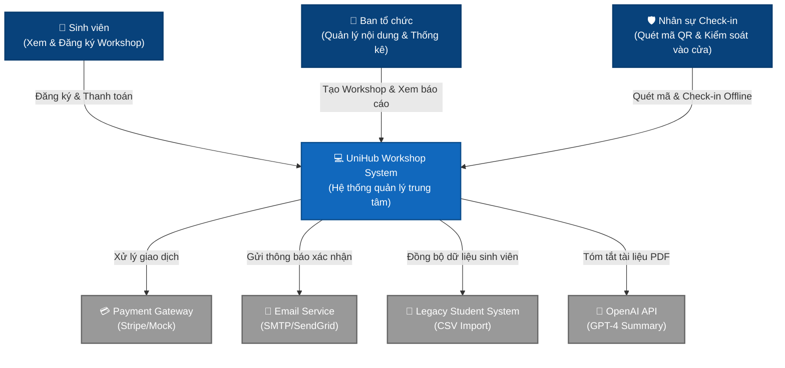
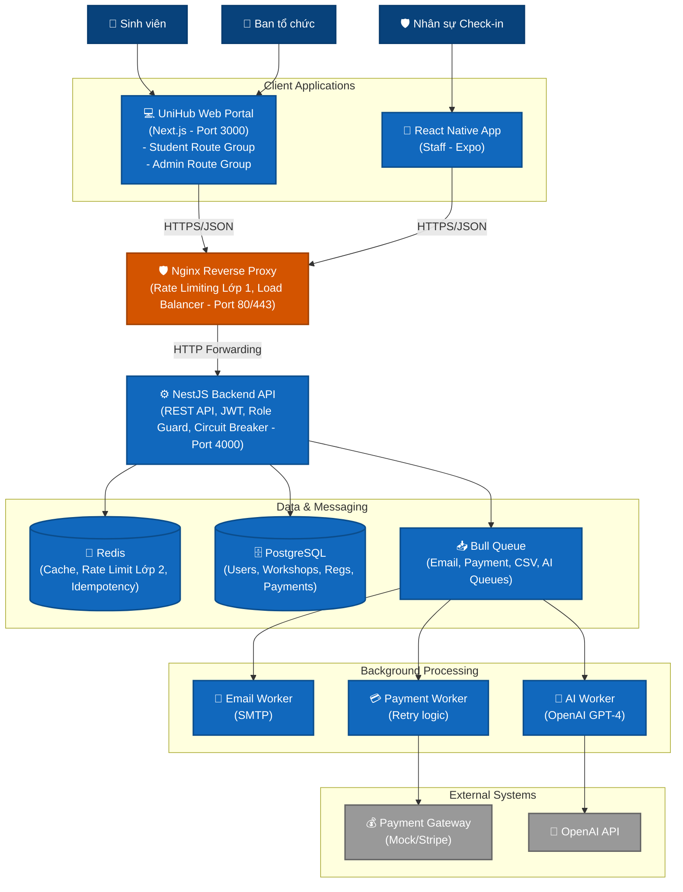
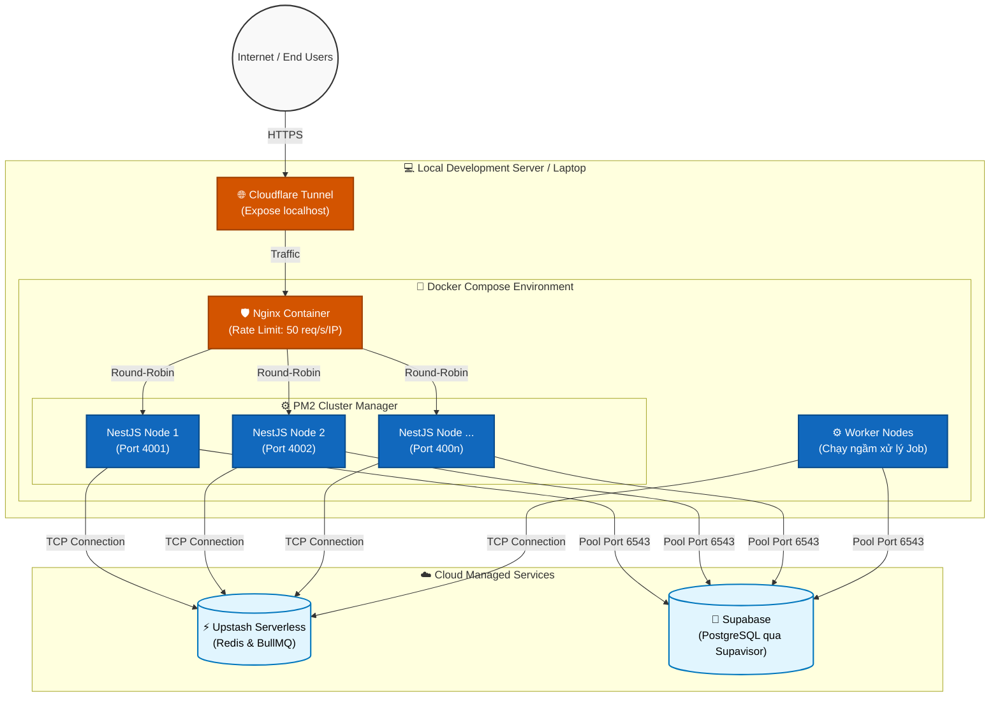
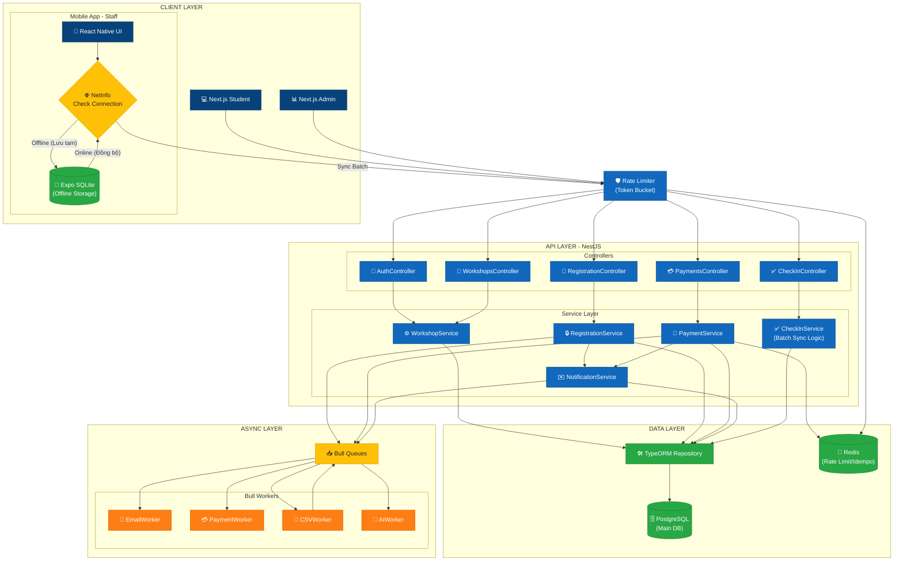

# UniHub Workshop — Technical Design

## Kiến trúc tổng thể

### Architectural Style & Lý do lựa chọn

Hệ thống áp dụng phong cách Layered Architecture (Kiến trúc phân lớp) với 4 thành phần cốt lõi: Presentation, Application, Data, và Async Layer.

1. Tách biệt các mối quan tâm (Separation of Concerns): Việc chia nhỏ hệ thống giúp team dễ dàng làm việc song song (người làm Backend, người làm Mobile/Web) mà không bị xung đột.

2. Khả năng mở rộng theo chiều ngang (Horizontal Scalability): Application Layer (NestJS) có thể chạy nhiều instance thông qua Docker để xử lý lưu lượng lớn từ 12.000 sinh viên.

3. Đảm bảo tính phản hồi nhanh (Low Latency): Sử dụng Async Layer để đẩy các tác vụ nặng (gửi Email, xử lý AI, Import CSV) ra sau hậu trường, giúp người dùng nhận kết quả ngay lập tức.

4. Tính ổn định cao (Fault Tolerance): Kết hợp các mẫu thiết kế như Circuit Breaker để ngăn chặn lỗi dây chuyền khi các dịch vụ bên thứ ba (Payment Gateway) gặp sự cố.

### Các thành phần hệ thống (System Components)

Hệ thống được chia thành 4 lớp giao tiếp chặt chẽ với nhau:

- Presentation Layer (Lớp hiển thị):
  - Next.js 14: Cung cấp giao diện Web cho Sinh viên (đăng ký) và Ban tổ chức (quản lý).

  - React Native (Expo): Ứng dụng Mobile dành cho nhân sự Check-in tại sự kiện, hỗ trợ hoạt động offline.

- Application Layer (Lớp ứng dụng):
  - NestJS Framework: Đóng vai trò là bộ não xử lý trung tâm, cung cấp RESTful API, quản lý xác thực (JWT) và kiểm soát phân quyền (RBAC).

- Data Layer (Lớp dữ liệu):
  - PostgreSQL: Cơ sở dữ liệu quan hệ chính, đảm bảo tính toàn vẹn dữ liệu (ACID) cho các giao dịch đăng ký.

  - Redis: Lưu trữ dữ liệu tạm thời để xử lý Rate Limiting, Circuit Breaker và Cache.

- Async Layer (Lớp bất đồng bộ):
  - Bull Queue: Hàng đợi tác vụ dựa trên Redis để quản lý các công việc chạy ngầm (Workers).

### Cơ chế giao tiếp (Communication Patterns)

Sự tương tác giữa các thành phần được thực hiện qua các giao thức chuẩn:

1.  Client-to-Server (Request/Response): Các ứng dụng Web và Mobile giao tiếp với NestJS Backend thông qua giao thức HTTPS (REST API). Tất cả các yêu cầu đều được bảo mật bằng JWT Token.

2.  Server-to-Database: NestJS sử dụng TypeORM để thực hiện các truy vấn đến PostgreSQL. Đặc biệt, luồng đăng ký chỗ ngồi sử dụng Pessimistic Locking (FOR UPDATE) để ngăn chặn việc bán quá số lượng (oversell).

3.  In-process Communication: NestJS tương tác trực tiếp với Redis để kiểm tra Rate Limit (Token Bucket) và Idempotency Key trước khi xử lý logic nghiệp vụ.

4.  Producer-Consumer (Async): Khi có tác vụ nặng, Application Layer đóng vai trò "Producer" đẩy job vào Bull Queue (Redis). Các Workers độc lập đóng vai trò "Consumer" sẽ lấy job ra để thực thi và cập nhật trạng thái vào Database.

## C4 Diagram

### Level 1 — System Context

<!-- Sơ đồ: UniHub Workshop + actors + hệ thống ngoài -->

### Level 2 — Container

<!-- Sơ đồ: web app, mobile app, backend API, database, message broker, ... -->

### Level 4 — Deployment Diagram (Môi trường báo cáo/Local Cluster)

Sơ đồ này mô tả cách hệ thống được triển khai thực tế trên một máy chủ đơn lẻ (hoặc laptop) nhưng vẫn mô phỏng được kiến trúc chịu tải cao (High-Availability Cluster) để phục vụ cho buổi bảo vệ đồ án, kết hợp với Database và Redis được host trên Cloud.

## High-Level Architecture Diagram

<!-- Sơ đồ luồng dữ liệu, đặc biệt tại các điểm tích hợp và luồng check-in offline -->

## Thiết kế cơ sở dữ liệu

<!-- Loại database, lý do lựa chọn, schema các entity chính -->

### 1. Lựa chọn công nghệ và lý do

| Công nghệ   | Vai trò            | Lý do lựa chọn                                                                                                                                                                |
| ----------- | ------------------ | ----------------------------------------------------------------------------------------------------------------------------------------------------------------------------- |
| PostgreSQL  | Primary Database   | Tuân thủ tuyệt đối tính ACID để đảm bảo an toàn cho các giao dịch đăng ký và thanh toán. Hỗ trợ Row-level locking (FOR UPDATE) để xử lý tranh chấp chỗ ngồi (Race condition). |
| Redis       | Secondary Database | Tốc độ đọc/ghi cực nhanh để xử lý Rate Limiting (Token Bucket) và lưu trữ Idempotency keys trong 24h. Làm Message Broker cho hàng đợi Bull Queue.                             |
| Expo SQLite | Offline Storage    | Lưu trữ tạm thời dữ liệu check-in trên thiết bị di động của nhân sự khi không có mạng, cho phép truy vấn nhanh tại chỗ.                                                       |

### 2. Sơ đồ thực thể chính (Main Entities Schema)

Hệ thống sử dụng UUID làm khóa chính (PK) cho tất cả các bảng để tăng tính bảo mật và dễ dàng mở rộng khi thực hiện phân tán dữ liệu.

A. **Users Table**  
Lưu trữ thông tin định danh và vai trò của mọi đối tượng trong hệ thống.

- id (UUID, PK): Định danh duy nhất.

- name (String): Họ tên người dùng.

- student_id (String, Unique): Mã số sinh viên (được import từ hệ thống cũ).

- email (String, Unique): Email đăng nhập.

- password_hash (String): Mật khẩu đã được băm (Hash) để bảo mật.

- role (Enum): student, organizer, staff.

B. **Workshops Table**

Thành phần trung tâm quản lý số lượng chỗ ngồi.

- id (UUID, PK): Định danh workshop.

- capacity (Integer): Tổng số chỗ ngồi tối đa.

- registered_count (Integer): Số lượng đã đăng ký (Dùng cho Pessimistic Locking).

- price (Decimal): Giá vé (0 nếu miễn phí).

- title (String): Tiêu đề workshop.

- detail (Text): Nội dung về workshop.

- start_time (Timestamp): Thời gian bắt đầu workshop.

- end_time (Timestamp): Thời gian kết thúc workshop.

- room (String): Phòng tổ chức.

- speaker (String): Diễn giả.

C. **Registrations Table**  
Bảng trung gian quản lý mối quan hệ giữa sinh viên và workshop.

- id (UUID, PK): Mã giao dịch.

- user_id (UUID, FK): Tham chiếu tới bảng Users.

- workshop_id (UUID, FK): Tham chiếu tới bảng Workshops.

- status (Enum): pending, confirmed, cancelled, checked_in.

- qr_code (String, Unique): Mã định danh duy nhất để check-in.

- payment_id (UUID, FK): Liên kết với bảng thanh toán.

- registered_at (Timestamp): Thời điểm đăng ký.

- expires_at (Timestamp): Thời điểm hết hạn giữ chỗ (nếu có).

D. **Payments Table**
Lưu trữ lịch sử giao dịch và chống trừ tiền hai lần.

- id (UUID, PK): Mã thanh toán.

- registration_id (UUID, FK, Unique): Tham chiếu tới lượt đăng ký (một registration chỉ có một payment).

- idempotency_key (String, Unique): Khóa chống trùng lặp gửi từ Client.

- transaction_id (String): Mã tham chiếu từ cổng thanh toán (Mock).

- status (Enum): pending, success, failed.

E. **CHECK_INS** (Xử lý Offline & Sync)  
Được thiết kế đặc biệt để phục vụ luồng đồng bộ từ Mobile App.

- id (UUID, PK): Khóa chính của bản ghi check-in.

- registration_id (UUID, FK, Unique): Tham chiếu tới lượt đăng ký.

- sync_status (Enum): synced, pending_sync (Dùng trên Mobile SQLite).

- staff_id (UUID, FK): Định danh nhân viên thực hiện check-in.

- checked_in_at (Timestamp): Thời điểm quét mã thực tế (ngay cả khi offline).

### 3. Chiến lược Indexing (Optimization)

Để đảm bảo hệ thống phản hồi dưới 200ms khi 12,000 sinh viên truy cập cùng lúc, các Index sau sẽ được thiết lập:

- Unique Index trên registrations(workshop_id, user_id): Ngăn chặn một sinh viên đăng ký một workshop hai lần ở mức database.

- B-Tree Index trên workshops(start_time) và workshops(status): Tối ưu hóa việc tìm kiếm các workshop đang mở.

- Hash Index trên registrations(qr_code): Tăng tốc độ tìm kiếm bản ghi khi nhân sự quét mã check-in.

- TTL Index trên Redis cho idempotency_key: Tự động xóa các khóa sau 24h để giải phóng bộ nhớ.

## Thiết kế kiểm soát truy cập

<!-- Mô hình phân quyền, các nhóm người dùng, cách kiểm tra quyền tại từng điểm truy cập -->

### 1. Các nhóm người dùng (User Roles)

Hệ thống định nghĩa 03 nhóm quyền hạn chính:

- Student (Sinh viên): Nhóm người dùng đông đảo nhất (dự kiến 12,000 người), có quyền xem thông tin và thực hiện đăng ký workshop.

- Organizer (Ban tổ chức): Nhóm quản trị viên có quyền hạn cao nhất đối với nội dung workshop và quản lý dữ liệu sinh viên.

- Staff (Nhân sự hỗ trợ): Nhóm chuyên trách việc vận hành tại sự kiện, tập trung vào tính năng quét mã QR và xác nhận check-in.

### 2. Ma trận phân quyền (Permission Matrix)

Ma trận dưới đây chi tiết hóa khả năng truy cập tài nguyên của từng vai trò:

| Tài nguyên (Resource) | Hành động (Action)           | Student | Organizer | Staff |
| --------------------- | ---------------------------- | ------- | --------- | ----- |
| Workshops             | Xem danh sách/chi tiết       | ✅      | ✅        | ✅    |
|                       | Tạo mới/Sửa/Xóa              | ❌      | ✅        | ❌    |
|                       | AI Summary generation        | ❌      | ✅        | ❌    |
| Registrations         | Đăng ký tham gia             | ✅      | ❌        | ❌    |
|                       | Hủy đăng ký (của bản thân)   | ✅      | ❌        | ❌    |
|                       | Xem tất cả danh sách đăng ký | ❌      | ✅        | ❌    |
| Check-ins             | Quét QR & Xác nhận           | ❌      | ❌        | ✅    |
|                       | Đồng bộ dữ liệu Offline      | ❌      | ❌        | ✅    |
| Analytics             | Xem thống kê số lượng        | ❌      | ✅        | ❌    |
| Data Import           | Import CSV sinh viên         | ❌      | ✅        | ❌    |

### 3. Cơ chế kiểm tra quyền tại các điểm truy cập

Hệ thống thực hiện kiểm tra quyền tại hai cấp độ chính để đảm bảo an ninh lớp lang (Defense in Depth):

- A. Kiểm tra tại Backend (NestJS Guards)
  - Authentication Guard: Sử dụng Passport-JWT để xác thực danh tính người dùng qua Access Token đính kèm trong Header request.
  - Roles Guard: Trích xuất trường role từ JWT Payload và đối chiếu với role cho phép được đặt tại mỗi Controller hoặc Endpoint. Nếu vai trò không khớp, hệ thống sẽ trả về mã lỗi 403 Forbidden.
- B. Kiểm tra tại Frontend (Next.js)
  - Middleware Protection: Middleware sẽ chặn các truy cập vào Route Group (admin)/\* nếu role trong Token không phải là organizer.
  - Conditional Rendering: Giao diện sẽ ẩn/hiện các nút bấm (như nút "Tạo Workshop" hay "Thanh toán") dựa trên quyền hạn hiện tại để tránh gây nhầm lẫn cho người dùng.
- C. Kiểm tra tại Mobile App
  - Ứng dụng Expo chỉ cho phép người dùng có role staff đăng nhập.
  - Mọi yêu cầu đồng bộ (Sync) dữ liệu check-in lên server đều được kiểm tra token một lần nữa tại Backend để tránh trường hợp giả mạo dữ liệu.

## Thiết kế các cơ chế bảo vệ hệ thống

### Kiểm soát tải đột biến

Để bảo vệ hệ thống khỏi các đợt spike traffic (dự kiến 12.000 sinh viên truy cập cùng lúc), hệ thống triển khai cơ chế kiểm soát dựa trên thuật toán Token Bucket.

- Giải pháp: Sử dụng Redis để lưu trữ trạng thái bucket của từng người dùng (theo user_id hoặc IP).
- Thuật toán: Token Bucket cho phép xử lý các đợt burst traffic ngắn hạn nhưng vẫn đảm bảo tốc độ trung bình không vượt ngưỡng.
- Cấu hình ngưỡng:
  - Student: 10 requests / 10 giây (Phù hợp với thao tác đăng ký).
  - Organizer/Staff: 50 - 100 requests / 10 giây (Phù hợp với thao tác quản lý/check-in).
- Hành vi khi vượt ngưỡng: Hệ thống sẽ phản hồi mã lỗi 429 Too Many Requests kèm thông báo "Try again in X seconds".

### Xử lý cổng thanh toán không ổn định

Cổng thanh toán (Stripe/Mock) là thành phần phụ thuộc bên ngoài có rủi ro cao, có thể timeout/error. Nếu cứ gọi liên tục dễ tăng tải gateway, kéo dài thời gian recovery, user experience kém khi phải đợi timeout 10-30s mỗi request. Cơ chế Circuit Breaker giúp ngăn chặn việc treo hệ thống khi đối tác gặp sự cố.

- Giải pháp: Triển khai trạng thái ngắt mạch 3 cấp độ: CLOSED, OPEN, HALF-OPEN.
- Ngưỡng kích hoạt: Nếu có 5 lỗi liên tiếp (hoặc timeout) trong vòng 1 phút, mạch sẽ chuyển sang trạng thái OPEN.
- Hành vi khi lỗi:
  - Khi mạch OPEN: Mọi yêu cầu thanh toán bị từ chối ngay lập tức để giảm tải cho đối tác và hệ thống.
  - Graceful Degradation: Hệ thống vẫn cho phép lưu registration ở trạng thái pending_payment và đưa vào hàng đợi Bull Queue để retry sau khi mạch ổn định (trạng thái HALF-OPEN).

### Chống trừ tiền hai lần

Tránh việc người dùng nhấn nút "Thanh toán" nhiều lần hoặc do mạng chập chờn dẫn đến duplicate transaction.

- Giải pháp: Idempotency Key
- Định nghĩa:
  Idempotency: `f(x)` gọi 1 lần = gọi N lần → Kết quả giống hệt nhau
- Flow:
  - Cơ chế: Sử dụng Idempotency Key (UUID v4) được tạo từ phía Client cho mỗi yêu cầu thanh toán.
  - Nơi lưu trữ: Redis (lưu kết quả response trong 24h) và Database (Unique constraint cho cột idempotency_key trong bảng payments).
  - Luồng xử lý:
    - Kiểm tra Key trong Redis/DB. Nếu tồn tại, trả về ngay kết quả đã xử lý trước đó.
    - Nếu chưa, thực hiện thanh toán trong một Database Transaction duy nhất.
    - Lưu kết quả vào Cache trước khi phản hồi cho Client.

## Các quyết định kỹ thuật quan trọng (ADR)

Lựa chọn NestJS thay vì Express.js

- Quyết định: Sử dụng NestJS làm Framework chính cho Backend.
- Lý do: NestJS cung cấp cấu trúc module rõ ràng, tích hợp sẵn Dependency Injection, Guards, và Decorators. Điều này giúp nhóm 2-3 người dễ dàng cộng tác và bảo trì.
- Đánh đổi: Phức tạp hơn Express ban đầu nhưng tiết kiệm 30-40% thời gian code logic nền tảng (validation, auth).

Sử dụng Pessimistic Locking cho việc giữ chỗ

- Quyết định: Sử dụng FOR UPDATE (Pessimistic Write Lock) khi truy vấn số lượng chỗ trống trong workshop.
- Lý do: Trong kịch bản 12.000 user tranh giành 60 chỗ, Optimistic Locking (dựa trên version) sẽ gây ra tỷ lệ lỗi/retry rất cao. Pessimistic Locking đảm bảo tính toàn vẹn tuyệt đối (0% oversell).
- Đánh đổi: Throughput giảm nhẹ do các transaction phải đợi nhau, nhưng chấp nhận được vì tính chính xác là ưu tiên hàng đầu.

Bull Queue (Redis-based) thay vì RabbitMQ

- Quyết định: Sử dụng Bull làm Message Broker cho các tác vụ bất đồng bộ (Email, Sync, AI).
- Lý do: Nhóm đã sử dụng Redis cho Rate Limiting và Caching, việc dùng Bull giúp giảm thiểu số lượng dependency cần cài đặt (không cần Erlang/RabbitMQ). Bull hỗ trợ tốt cơ chế retry và delayed jobs.
- Đánh đổi: Phụ thuộc vào tính sẵn sàng của Redis. Nếu Redis down, hàng đợi sẽ bị gián đoạn.

Kiến trúc Offline-first cho Mobile Check-in

- Quyết định: Sử dụng Expo SQLite để lưu trữ dữ liệu check-in tạm thời trên thiết bị.
- Lý do: Đảm bảo nhân sự có thể điểm danh liên tục trong hội trường ngay cả khi mất kết nối mạng. Dữ liệu sẽ tự động đồng bộ (Background Sync) khi có mạng trở lại.
- Đánh đổi: Phải xử lý logic xung đột dữ liệu khi đồng bộ batch từ nhiều thiết bị khác nhau.

Next.js App Router & Server Components

- Quyết định: Sử dụng Next.js 14 cho Frontend Web.
- Lý do: Tận dụng Server-Side Rendering (SSR) để tối ưu SEO cho các trang workshop listing và giảm kích thước bundle size gửi xuống trình duyệt (Client-side).
- Đánh đổi: Phải quản lý sự khác biệt giữa Client và Server Components chặt chẽ hơn so với mô hình SPA truyền thống.
