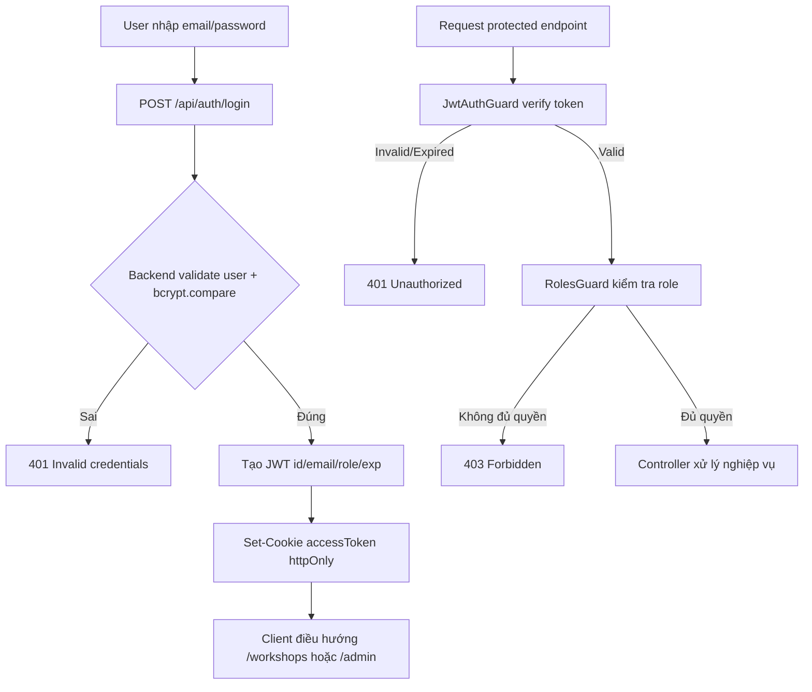
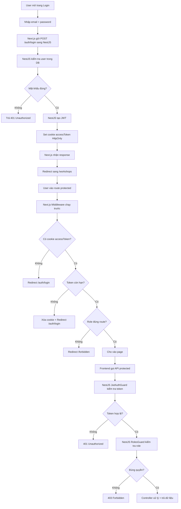

# JWT Trong Next.js: Từ Cơ Bản Đến Áp Dụng Vào Đồ Án UniHub

## 1) JWT là gì (mức nhập môn)

JWT (JSON Web Token) là một chuỗi dùng để xác thực danh tính người dùng sau khi đăng nhập.

Một JWT có 3 phần:

- Header
- Payload
- Signature

Dạng tổng quát:

```text
header.payload.signature
```

Ví dụ:

```text
eyJhbGciOiJIUzI1NiIsInR5cCI6IkpXVCJ9
.eyJpZCI6IjEyMyIsImVtYWlsIjoic3R1ZGVudEB1bmkuZWR1Iiwicm9sZSI6InN0dWRlbnQiLCJleHAiOjE3MDAwMDAwMDB9
.CfS3...
```

JWT không mã hóa payload theo nghĩa bí mật tuyệt đối, mà chủ yếu ký số để chống sửa nội dung.

## 2) Cách JWT hoạt động

Luồng chuẩn:

1. User login bằng email/password.
2. Backend kiểm tra mật khẩu đúng.
3. Backend tạo JWT chứa thông tin cần thiết (id, email, role, exp).
4. Backend gửi token về client (khuyến nghị qua httpOnly cookie).
5. Mỗi request protected, token được gửi lại.
6. Backend verify chữ ký + hạn dùng trước khi cho phép truy cập.

Nếu token sai chữ ký hoặc hết hạn, trả 401.

## 3) Thành phần claims quan trọng

- `sub` hoặc `id`: định danh user.
- `email`: email user.
- `role`: quyền user (student, organizer, staff, admin).
- `iat`: thời điểm cấp token.
- `exp`: thời điểm hết hạn.
- `jti` (nâng cao): id duy nhất cho token để revoke/blacklist.

## 4) JWT trong Next.js nên dùng thế nào

### 4.1 Lưu token

Khuyến nghị production:

- Dùng `httpOnly cookie` để giảm rủi ro XSS đánh cắp token.
- Tránh phụ thuộc localStorage/sessionStorage cho access token.

Cookie nên có:

- `httpOnly: true`
- `secure: true` (khi production HTTPS)
- `sameSite: 'lax'` hoặc `'strict'` tùy flow
- `path: '/'`
- `maxAge` phù hợp

### 4.2 Bảo vệ route ở Next.js

Dùng `middleware.ts` để:

- Chặn user chưa login khỏi route protected.
- Redirect user đã login khỏi trang `/auth/login` và `/auth/register`.
- Kiểm tra role để chặn truy cập sai quyền.

### 4.3 Gọi API từ Next.js

Khi backend dùng cookie auth:

- Fetch phải có `credentials: 'include'`.
- Không cần tự gắn Bearer token nếu backend đã đọc cookie.

## 5) Áp dụng vào đồ án UniHub (liên hệ trực tiếp code hiện tại)

Hiện tại đồ án đã có các thành phần tốt:

- Backend đã set cookie `accessToken` sau login/register.
- Backend có `JwtStrategy` + `JwtAuthGuard` + `RolesGuard`.
- Frontend middleware đã đọc cookie để redirect.

Các điểm cần chuẩn hóa thêm để đúng spec và an toàn hơn:

1. Tránh dùng song song cookie + sessionStorage cho access token.
2. Bắt buộc `JWT_SECRET` từ biến môi trường (không fallback hard-code).
3. Bổ sung rate limit cho `/auth/login` và `/auth/register`.
4. Chuẩn hóa thông điệp lỗi 401/403 theo spec.
5. Mở rộng RBAC theo permission matrix đầy đủ (workshops/registrations/check-ins/analytics).

## 6) Sơ đồ luồng cho dự án





## 7) Checklist triển khai theo từng file trong đồ án

## Backend

### 7.1 `src/server/src/modules/auth/auth.module.ts`

- [ ] Dùng `JwtModule.registerAsync` đọc secret từ env.
- [ ] Nếu thiếu `JWT_SECRET` thì throw khi boot app.
- [ ] Không để fallback dev secret trên production.

Ví dụ ngắn:

```ts
JwtModule.registerAsync({
  useFactory: () => {
    const secret = process.env.JWT_SECRET;
    if (!secret || secret.length < 32) {
      throw new Error('JWT_SECRET must be at least 32 chars');
    }

    return {
      secret,
      signOptions: { expiresIn: '7d' },
    };
  },
});
```

### 7.2 `src/server/src/modules/auth/strategies/jwt.strategy.ts`

- [ ] Chỉ nhận token từ nguồn bạn quyết định (cookie hoặc header, hoặc cả hai).
- [ ] Luôn verify với secret env.
- [ ] Trả payload tối thiểu (`id`, `role`, `email`).

### 7.3 `src/server/src/modules/auth/auth.controller.ts`

- [ ] Login/Register set cookie nhất quán.
- [ ] Logout clear cookie cùng cấu hình path/domain tương ứng.
- [ ] Trả response không chứa password hash.

### 7.4 `src/server/src/modules/auth/auth.service.ts`

- [ ] `register`: check studentId + email đúng dữ liệu import.
- [ ] `register`: nếu `passwordHash` đã có thì 409.
- [ ] `login`: sai email/password trả 401 cùng message trung tính.
- [ ] Hash password bằng async bcrypt.
- [ ] Tạo payload có role rõ ràng.
- [ ] (Nâng cao) thêm `jti` để phục vụ revoke.

### 7.5 `src/server/src/modules/auth/guards/roles.guard.ts`

- [ ] Đảm bảo chạy sau `JwtAuthGuard` ở route protected.
- [ ] Đối chiếu role với metadata `@Roles(...)`.
- [ ] Trả 403 khi thiếu quyền.

### 7.6 `src/server/src/main.ts`

- [ ] `app.enableCors({ origin, credentials: true })`.
- [ ] `cookieParser()` đã bật.
- [ ] ValidationPipe đã bật `whitelist`.

## Frontend

### 7.7 `src/web-client/middleware.ts`

- [ ] Nếu không có token, chặn route protected.
- [ ] Nếu token hết hạn/sai, xóa cookie và redirect login.
- [ ] Nếu đã login, chặn quay lại trang auth.
- [ ] Phân quyền route theo role.

### 7.8 `src/web-client/lib/auth.ts`

- [ ] Tất cả request auth dùng `credentials: 'include'`.
- [ ] Ưu tiên cookie-only flow.
- [ ] Hạn chế lưu access token vào sessionStorage/localStorage.

### 7.9 `src/web-client/lib/jwt.ts`

- [ ] Decode payload chỉ để hỗ trợ điều hướng UI.
- [ ] Không dùng decode làm căn cứ bảo mật cuối cùng.
- [ ] Quyết định bảo mật cuối cùng luôn ở backend guard.

## 8) Mapping role theo permission matrix

Đề xuất mapping trong controller:

- `GET /workshops`: `student`, `organizer`
- `POST /workshops`: `organizer`
- `PUT/DELETE /workshops/:id`: `organizer`
- `POST /registrations`, `GET /registrations/my`, `DELETE /registrations/:id`: `student`
- `POST /check-ins`, `POST /check-ins/batch`: `staff`
- `GET /admin/analytics`: `organizer`

Ví dụ:

```ts
@UseGuards(JwtAuthGuard, RolesGuard)
@Roles('organizer')
@Post('workshops')
createWorkshop() {}
```

## 9) Sai lầm phổ biến cần tránh

1. Tin payload decode ở frontend như nguồn sự thật bảo mật.
2. Hard-code JWT secret trong code.
3. Trả lỗi login quá chi tiết (lộ user tồn tại hay không).
4. Quên rate limit endpoint auth.
5. Không set `credentials: 'include'` khi dùng cookie auth.
6. Không clear cookie khi logout hoặc token invalid.

## 10) Lộ trình nâng cấp bảo mật (ưu tiên)

1. Bắt buộc env `JWT_SECRET` >= 32 ký tự.
2. Cookie chuẩn production (`secure`, `sameSite`, domain rõ ràng).
3. Thêm rate-limiting với Redis cho auth endpoints.
4. Thêm refresh token rotation (nếu cần phiên dài).
5. Bổ sung test theo các TC trong spec (AUTH/SEC/PERF).

## 11) Kết luận ngắn

- JWT giúp hệ thống stateless, scale tốt.
- Next.js nên dùng middleware + cookie httpOnly để bảo vệ route.
- Trong đồ án này, nền tảng đã đúng hướng; cần chuẩn hóa bảo mật và hoàn thiện RBAC theo matrix để đạt tiêu chí chấp nhận.

