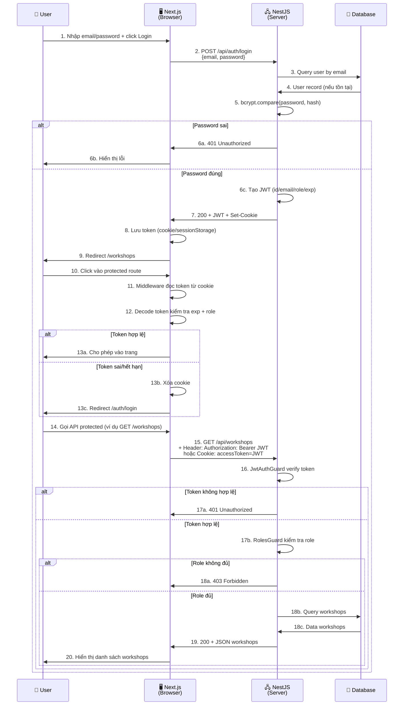

# Next.js vs NestJS vs JWT: Hiểu Rõ Kiến Trúc Đồ Án

## 1) Next.js là gì?

### Định nghĩa đơn giản
Next.js là một **framework phía client** (frontend) để xây dựng giao diện web.

### Đặc điểm chính
- Xây dựng trên React.
- Dùng App Router hoặc Pages Router để tổ chức trang.
- Hỗ trợ Server-Side Rendering (SSR), Static Generation (SSG), hoặc Client-Side Rendering (CSR).
- Có middleware để xử lý logic giữa request/response trước khi đến route.

### Điểm quan trọng
Next.js chạy ở phía client (browser), tương tác với backend qua API.

### Ví dụ dự án bạn
- Đường dẫn: `src/web-client/`
- Hiển thị form login, trang workshops, dashboard admin.
- Gọi backend API để lấy dữ liệu.

## 2) NestJS là gì?

### Định nghĩa đơn giản
NestJS là một **framework phía server** (backend) để xây dựng API REST hoặc GraphQL.

### Đặc điểm chính
- Xây dựng trên Express.js hoặc Fastify.
- Dùng kiến trúc modular (Module, Controller, Service, Guard, Pipe...).
- Hỗ trợ Dependency Injection (DI) giống Angular.
- Mạnh ở xác thực (authentication), phân quyền (authorization).
- Dễ tích hợp database (TypeORM, Prisma...).

### Điểm quan trọng
NestJS chạy ở phía server, tiếp nhận request từ Next.js và trả data.

### Ví dụ dự án bạn
- Đường dẫn: `src/server/`
- Cung cấp API: `/api/auth/login`, `/api/auth/register`, `/api/workshops`...
- Xử lý logic, database, xác thực JWT.

## 3) Mối liên hệ giữa Next.js và NestJS

Chúng là hai phần trong kiến trúc **client-server** (2-tier):

```
[Next.js - Browser]
        |
        | HTTP/REST API
        | (JSON requests/responses)
        |
   [NestJS - Server]
        |
   [Database - PostgreSQL]
```

### Cách giao tiếp

1. **Client (Next.js) gửi request:**
   - User nhập email/password.
   - Next.js gọi `POST /api/auth/login` (với credentials, JSON body).

2. **Server (NestJS) nhận request:**
   - NestJS nhận POST request ở `/api/auth/login`.
   - Validate dữ liệu.
   - Query database.
   - Trả response JSON + set cookie.

3. **Client (Next.js) nhận response:**
   - Lưu token (cookie hoặc sessionStorage).
   - Điều hướng trang hoặc gọi API khác.

## 4) JWT trong mối liên hệ Next.js + NestJS

JWT là "cầu nối" giữa client và server:

### Quy trình chi tiết



### Giải thích từng bước

| Bước | Ai thực hiện | Cái gì |
|------|-------------|--------|
| 1-2 | User → Next.js | Click login, gửi form |
| 3-4 | Next.js → NestJS → DB | Yêu cầu tìm user |
| 5 | NestJS | Kiểm tra mật khẩu (bcrypt) |
| 6 | NestJS → Next.js | Trả lỗi hoặc tiếp tục |
| 7-8 | NestJS → Next.js | Tạo JWT, set cookie, trả token |
| 9 | Next.js → User | Lưu token, redirect trang |
| 10-13 | Next.js | Middleware bảo vệ route |
| 14-20 | Next.js → NestJS → DB → Next.js | Gọi API protected, verify JWT, trả data |

## 5) Vai trò cụ thể trong dự án bạn

### Next.js (Frontend)
- **File:** `src/web-client/`
- **Trách nhiệm:**
  - Tạo giao diện: form login, trang workshops, dashboard.
  - Gọi API backend qua fetch/axios.
  - Lưu token (cookie từ server, hoặc sessionStorage client).
  - Middleware bảo vệ route (redirect nếu chưa login).
  - Decode token để biết role → điều hướng (admin dashboard vs student workshop list).

### NestJS (Backend)
- **File:** `src/server/`
- **Trách nhiệm:**
  - Cung cấp API endpoint: `/api/auth/login`, `/api/auth/register`, `/api/workshops`...
  - Validate request.
  - Query database (user, workshop, registration, check-in...).
  - Tạo/verify JWT.
  - Set cookie httpOnly.
  - Guard xác thực (JwtAuthGuard) + Guard phân quyền (RolesGuard).
  - Trả response JSON.

## 6) Dòng chảy dữ liệu JWT cụ thể

### Khi đăng nhập

```
Next.js:
  email: "student@uni.edu"
  password: "SecurePass123"
    ↓ fetch with credentials: include
NestJS:
  Validate email/password
  Hash mật khẩu với bcrypt compare
    ↓ Hợp lệ
  Tạo JWT:
    header: { alg: "HS256" }
    payload: {
      id: "uuid",
      email: "student@uni.edu",
      role: "student",
      iat: 1704067200,
      exp: 1704672000  // 7 ngày sau
    }
    signature: HMAC(header.payload, JWT_SECRET)
    ↓ Set-Cookie: accessToken=<JWT>; HttpOnly; Secure; SameSite=Lax
    ↓ Response 201 { accessToken, user }
Next.js:
  Nhận token
  Lưu vào cookie (auto từ browser)
  hoặc lưu sessionStorage (manual từ code)
  Redirect /workshops
```

### Khi truy cập trang protected

```
Next.js Middleware:
  1. Đọc cookie accessToken
  2. Decode payload (check exp, role)
  3. Nếu valid và user chưa qua trang auth → next()
  4. Nếu invalid hoặc hết hạn → clear cookie + redirect /auth/login
     ↓
NestJS Guard (khi gọi API protected):
  1. Lấy token từ Authorization header hoặc cookie
  2. Verify signature bằng JWT_SECRET
  3. Kiểm tra exp (hết hạn chưa?)
  4. Attach user payload vào request object
  5. RolesGuard kiểm tra role có quyền gọi endpoint này không?
  6. Nếu tất cả OK → cho phép Controller xử lý
  7. Nếu lỗi → 401 hoặc 403
```

## 7) Sơ đồ kiến trúc tổng quát

```
┌─────────────────────────────────────────────────────────┐
│                   Internet / Browser                    │
└──────────────────────┬──────────────────────────────────┘
                       │
                       │ HTTP/REST
                       │
        ┌──────────────▼──────────────┐
        │     Next.js (Port 3001)     │
        │  ┌────────────────────────┐ │
        │  │ Pages & Components     │ │
        │  │ (Login, Dashboard...)  │ │
        │  └────────────────────────┘ │
        │  ┌────────────────────────┐ │
        │  │ lib/auth.ts            │ │
        │  │ (fetch API calls)      │ │
        │  └────────────────────────┘ │
        │  ┌────────────────────────┐ │
        │  │ middleware.ts          │ │
        │  │ (route protection)     │ │
        │  └────────────────────────┘ │
        │  ┌────────────────────────┐ │
        │  │ lib/jwt.ts             │ │
        │  │ (decode JWT payload)   │ │
        │  └────────────────────────┘ │
        └──────────────┬───────────────┘
                       │
                       │ API: GET/POST /api/*
                       │
        ┌──────────────▼───────────────┐
        │     NestJS (Port 3000)      │
        │  ┌────────────────────────┐ │
        │  │ modules/auth/          │ │
        │  │ (controller, service)  │ │
        │  └────────────────────────┘ │
        │  ┌────────────────────────┐ │
        │  │ guards/                │ │
        │  │ (JWT verify, RBAC)     │ │
        │  └────────────────────────┘ │
        │  ┌────────────────────────┐ │
        │  │ modules/workshops/     │ │
        │  │ modules/registrations/ │ │
        │  │ modules/check-ins/     │ │
        │  └────────────────────────┘ │
        └──────────────┬───────────────┘
                       │
                       │ SQL
                       │
        ┌──────────────▼───────────────┐
        │  PostgreSQL (Port 5432)     │
        │  ┌────────────────────────┐ │
        │  │ users table            │ │
        │  │ workshops table        │ │
        │  │ registrations table    │ │
        │  │ check_ins table        │ │
        │  └────────────────────────┘ │
        └─────────────────────────────┘
```

## 8) JWT flow tổng quát

```
┌─────────────┐
│ JWT Token   │
│─────────────│
│ header      │ → { alg: "HS256", typ: "JWT" }
│ payload     │ → { id, email, role, iat, exp }
│ signature   │ → HMAC(header.payload, JWT_SECRET)
└─────────────┘
       │
       ├─► Next.js lưu (cookie httpOnly)
       │
       └─► Gửi lại mỗi request (qua Authorization header hoặc cookie)
                │
                └─► NestJS verify
                     ├─ Kiểm tra chữ ký (signature)
                     ├─ Kiểm tra exp (hết hạn chưa?)
                     ├─ Trích thông tin user (id, role)
                     └─ Quyết định allow/deny request
```

## 9) Tóm tắt mối quan hệ 3 thành phần

| Thành phần | Vai trò | Nơi chạy | Liên quan JWT |
|-----------|---------|---------|------|
| **Next.js** | Frontend, UI | Browser | Lưu token (cookie), decode để biết role, gửi token trong request |
| **NestJS** | Backend, API | Server | Tạo JWT, verify JWT, protect endpoint bằng guard |
| **JWT** | Token xác thực | Cả client & server | Kết nối giữa client-server, chứng minh danh tính |

## 10) Kết luận

- **Next.js = Gương mặt của ứng dụng** (bạn nhìn thấy).
- **NestJS = Não của ứng dụng** (xử lý logic, lưu data).
- **JWT = Thẻ căn cước** (chứng minh bạn là ai, được làm gì).
- Chúng liên kết qua HTTP/REST API, token JWT là "chìa khóa" để Next.js tương tác an toàn với NestJS.

Trong dự án bạn, 2 thành phần này chạy độc lập (Next.js port 3001, NestJS port 3000) nhưng cùng "nói chuyện" bằng JWT và cookie.
