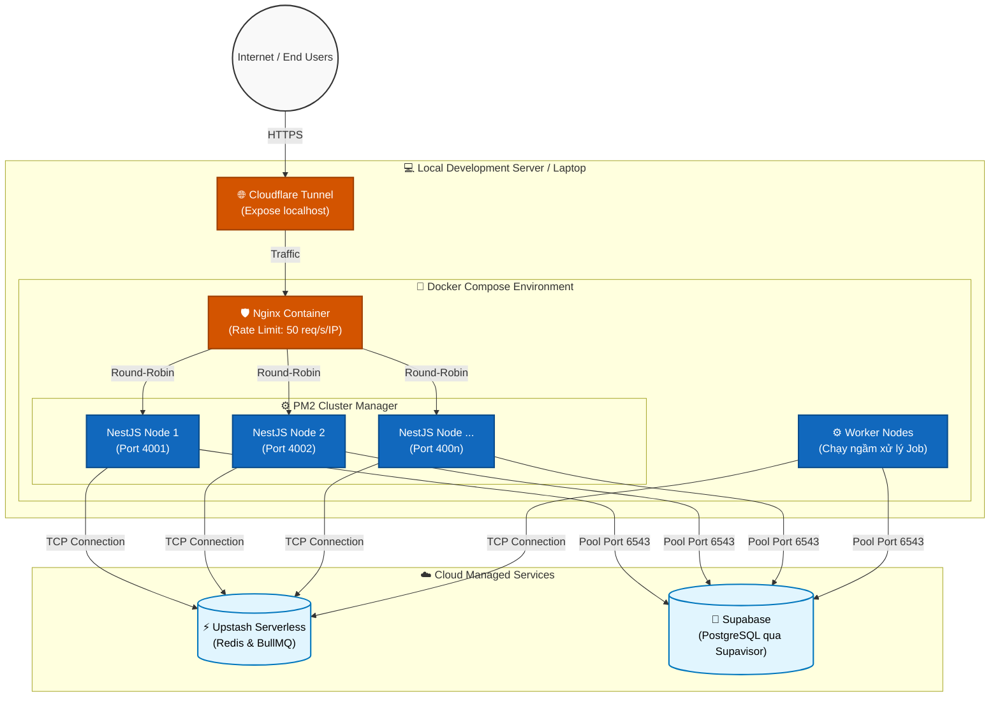
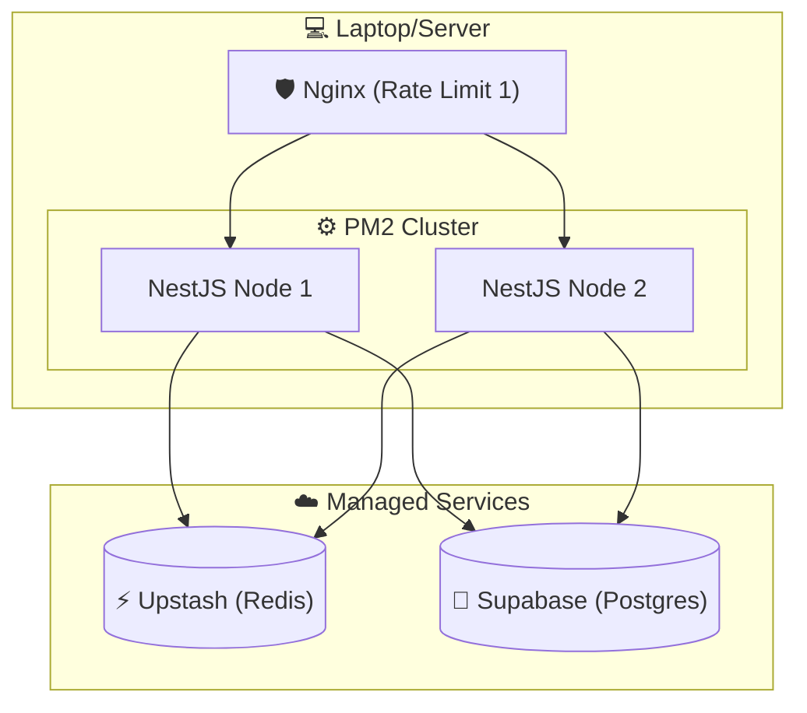

# UNIHUB WORKSHOP - SYSTEM ARCHITECTURE & MODULES

## 1. Tổng quan Công nghệ (Tech Stack)

Hệ thống được thiết kế theo mô hình kiến trúc phân lớp (Layered Architecture) để đảm bảo khả năng mở rộng và bảo trì.

- **Web Client:** Next.js 14 (App Router). Dùng SSR để tối ưu hiển thị danh sách Workshop.
- **Mobile Client:** React Native (Expo). Chế độ "Offline-first" cho nhân sự check-in bằng SQLite.
- **Backend Server:** NestJS. Framework modular, hỗ trợ tốt Dependency Injection và RBAC Guards.
- **Database:** PostgreSQL (Host trên Supabase).
- **Cache/Queue:** Redis (Host trên Upstash Serverless).

---

## 2. Chi tiết Hạ tầng (Infrastructure)

### Database: Supabase (PostgreSQL)

- **Cấu hình:** Sử dụng **Connection Pooling (Supavisor)** qua Port 6543.
- **Chế độ:** **Transaction Mode**. Giúp quản lý hàng ngàn kết nối từ server tới DB mà không làm sập DB khi có 12.000 sinh viên truy cập cùng lúc.
- **Concurrency:** Sử dụng **Pessimistic Locking (FOR UPDATE)** trong luồng đăng ký để đảm bảo 0% bán quá số chỗ (oversell).

### Cache & Queue: Upstash (Redis)

- **Rate Limit:** Lưu trữ bộ đếm (Token Bucket) để chặn spam request.
- **Bull Queue:** Quản lý hàng đợi tác vụ nặng: Gửi Email xác nhận, xử lý AI Summary từ PDF.
- **Idempotency:** Lưu khóa chống thanh toán trùng lặp trong 24h.

---

## 3. Luồng xử lý & Bảo vệ hệ thống (System Flow)

**Mô hình luồng:**
`Người dùng` -> `Nginx` -> `PM2 Cluster (NestJS)` -> `DB/Redis`



1. **Nginx (Reverse Proxy):**
   - Đóng vai trò "Khiên chắn" đầu tiên.
   - **Rate Limit lớp 1:** Chặn các IP spam F5 quá 50 req/s ngay lập tức, không cho chạm vào code NestJS để bảo vệ CPU.
2. **PM2 Cluster Mode:**
   - Nhân bản app NestJS chạy trên tất cả các nhân CPU của máy chủ (Localhost) để xử lý song song.
3. **NestJS (Business Logic):**
   - Thực hiện xác thực JWT và kiểm tra quyền (Role Guard).
   - **Rate Limit lớp 2:** Kiểm tra giới hạn đăng ký theo MSSV qua Redis.

**GHI CHÚ: Lớp 1 bảo vệ Server khỏi bị sập do quá tải băng thông. Lớp 2 bảo vệ Hệ thống khỏi bị lạm dụng tính năng**

---

## 4. Công cụ Kiểm thử & Mô phỏng (Testing)

### Giả lập tải (Load Testing)

- **Công cụ:** **k6 (Grafana)**.
- **Kịch bản:** Bắn 12.000 request ảo trong 10 phút. Theo dõi chỉ số P95 response time và tỷ lệ lỗi để tối ưu hóa code.

### Mô phỏng sự cố (Chaos Testing)

- **Sập Payment Gateway:** Sử dụng API ẩn `/admin/payment-gateway/set-timeout-mode` để ép cổng thanh toán bị treo.
- **Kiểm tra Circuit Breaker:** Quan sát xem hệ thống có tự ngắt mạch (OPEN) sau 5 lỗi liên tiếp và chuyển sang luồng xử lý ngầm (Background Retry) hay không.

---

## 5. Sơ đồ triển khai (Deployment Diagram)



### **Công cụ mô phỏng dành cho Lead**

Để bạn có thể giải thích trực quan cho team về cách Nginx và Redis phối hợp để bảo vệ Server khỏi 12.000 sinh viên, tôi đã tạo một bộ mô phỏng luồng request dưới đây. Bạn có thể điều chỉnh tải lượng và xem "điểm nghẽn" nằm ở đâu.

**CHƯA BIẾT NÓ LÀ CÁI GÌ NỮA, TÌM HIỂU SAU**

```json?chameleon
{"component":"LlmGeneratedComponent","props":{"height":"750px","prompt":"Create a 'System Resilience Simulator' for a Tech Lead to explain backend architecture to their team. \n\nConcept: A request flows through 3 layers: Nginx -> NestJS (PM2) -> Redis/DB.\n\nInteractive Controls:\n1. Request Rate (Slider): 10 to 2000 req/s.\n2. Nginx Rate Limit (Toggle): On/Off. (If Off, high load hits NestJS directly).\n3. PM2 Cluster Size (Slider): 1 to 8 instances.\n4. Redis/DB Latency (Slider): 2ms (Good) to 500ms (Congested).\n\nVisuals:\n- A flow of 'particles' representing requests moving from left to right.\n- Nginx Gate: If Rate Limit is On and Load > Limit, show particles being 'destroyed' (Red color) at the gate.\n- NestJS Pool: Show 1 to 8 workers processing particles. If particles pile up, they turn yellow (latency).\n- Dashboard Metrics: CPU Load (%), Dropped Requests, Database Connections.\n\nLogic:\n- High Load + No Nginx = NestJS CPU spikes to 100% and requests fail.\n- Low Latency DB = Fast flow.\n- Large Cluster = Faster processing of particles.\n\nLanguage: Vietnamese (Tải lượng, Ngắt mạch, Hiệu năng, v.v.)","id":"im_4670292e6ba7332f"}}
```
